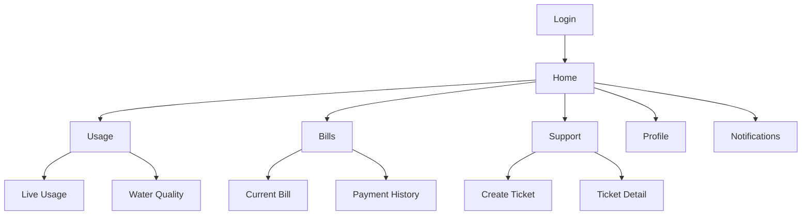
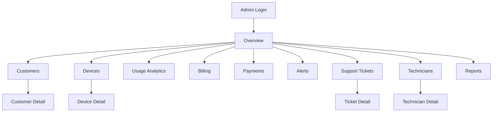

# Smart Water System Product Design

This design is based on the software design section of `Final  Year Project documentation.pdf`, especially the roles, use cases, and system behavior described for customers, technicians, administrators, and automated notifications.

## 1. Product Scope From the Thesis

### Customer-facing mobile app
The document says the customer should be able to:

- log in and manage profile
- view sensor dashboard
- monitor water usage and quality
- receive notifications
- pay water bills
- confirm payment
- view payment history
- create support tickets
- remotely control the water valve

### Administrative web dashboard
The document says administrators should be able to:

- register new customers and technicians
- view technician and customer profiles
- monitor all connected systems
- verify payments
- view support tickets
- analyze usage and anomalies
- monitor active customers and technicians
- receive notifications

### Shared system behavior
The document also describes:

- ESP32 collects flow and turbidity data
- data is sent in JSON through GSM/cloud connectivity
- Nest.js receives and stores data
- the system supports real-time alerts
- technicians can resolve tickets
- automated processes can assign technicians and send updates

## 2. Design Goals

1. Make the customer app simple enough for daily use on a phone.
2. Give administrators a fast operational dashboard, not just a reporting page.
3. Keep all critical actions status-driven: normal, warning, critical, offline.
4. Make billing, alerts, support, and valve control easy to find.
5. Design the two interfaces around the same backend entities and event model.

## 3. Core Product Structure

### Main actors

- Customer
- Technician
- System Administrator
- Automated System

### Core modules

- Authentication
- Device and meter monitoring
- Water quality monitoring
- Valve control
- Billing and payments
- Alerts and notifications
- Support tickets
- Technician assignment
- Reporting and analytics

## 4. Customer Mobile App Design

### Primary navigation

Use a 5-tab bottom navigation in Flutter:

- Home
- Usage
- Bills
- Support
- Profile

This keeps daily actions visible without deep menus.

### 4.1 Home screen

Purpose: give the customer the current state of their service in one glance.

#### Main sections

- Greeting and account summary
- Water status card
- Current flow rate
- Water quality card
- Valve control card
- Outstanding bill card
- Recent alerts list

#### Key widgets

- `Connection status`: Online, Delayed, Offline
- `Water quality status`: Safe, Warning, Unsafe
- `Today's usage`: liters or cubic meters
- `Current valve state`: Open or Closed
- `Current bill due`
- `Quick actions`: Pay bill, Open/Close valve, Raise support ticket

#### UX notes

- The valve control should require confirmation before closing or opening.
- Unsafe water quality should appear as a red priority card at the top.
- If the device is offline, show the last sync timestamp clearly.

### 4.2 Usage screen

Purpose: help customers understand consumption and detect waste.

#### Sections

- Live usage graph
- Daily, weekly, monthly consumption
- Historical trend chart
- Peak usage periods
- Leak/anomaly hints

#### Actions

- Filter by date range
- Compare current month vs previous month
- Export statement as PDF later in roadmap

#### Recommended charts

- Line chart for hourly/daily usage
- Bar chart for monthly totals
- Status badge for anomaly detection

### 4.3 Water Quality screen

This can be a card inside `Usage` or a dedicated subpage from `Home`.

#### Data shown

- Current turbidity reading
- Quality status label
- Trend over time
- Last safe reading timestamp
- Advice message

#### Example statuses

- `Safe`: within acceptable range
- `Warning`: borderline
- `Unsafe`: high turbidity, use caution

### 4.4 Bills screen

Purpose: make billing transparent and actionable.

#### Sections

- Current bill summary
- Due date
- Amount paid / unpaid
- Payment CTA
- Payment history
- Payment confirmation status

#### Payment flow

1. Customer opens current bill.
2. Customer taps `Pay Now`.
3. App opens supported payment method flow.
4. System records pending payment.
5. Customer sees confirmation result.
6. Billing history updates after verification.

#### Important UI states

- Paid
- Pending verification
- Overdue
- Failed

### 4.5 Support screen

Purpose: reduce friction when service issues happen.

#### Main features

- Create support ticket
- Choose issue category
- Add description
- Attach photo later if needed
- View ticket history
- Track ticket status

#### Ticket statuses

- Open
- Assigned
- In progress
- Resolved
- Closed

#### Suggested categories

- No water flow
- Low pressure
- Poor water quality
- Billing issue
- Device problem
- Valve control issue

### 4.6 Notifications center

Can live in `Home` with a full-screen inbox opened from the top-right bell icon.

#### Notification types

- Bill due reminder
- Payment confirmation
- High usage alert
- Poor water quality alert
- Valve state changed
- Device offline
- Ticket update

### 4.7 Profile screen

#### Sections

- Customer information
- Meter/device ID
- Address and installation details
- Preferred language
- Notification preferences
- Password reset
- Logout

## 5. Customer App Screen Map

## 6. Admin Web Dashboard Design

### Recommended layout

Use a desktop-first Next.js dashboard with:

- left sidebar navigation
- top bar for search, notifications, and admin profile
- summary cards at the top
- data tables and charts in the main content area

### Sidebar navigation

- Overview
- Customers
- Devices
- Usage Analytics
- Billing
- Payments
- Alerts
- Support Tickets
- Technicians
- Reports
- Settings

### 6.1 Overview dashboard

Purpose: help administrators understand the full system state immediately.

#### Top summary cards

- Total customers
- Active devices
- Offline devices
- Open tickets
- Overdue bills
- Critical alerts today

#### Main panels

- Real-time system map/list
- Usage trend chart
- Water quality warning list
- Latest payments
- Tickets waiting for action
- Recently offline systems

### 6.2 Customers module

Purpose: manage customer accounts and their service records.

#### Table columns

- Customer ID
- Name
- Phone
- Address
- Device ID
- Account status
- Current bill status
- Last activity

#### Actions

- Add customer
- Edit customer
- Suspend/reactivate account
- View usage history
- View billing history
- View ticket history

### 6.3 Devices module

Purpose: monitor installations and field hardware health.

#### Table columns

- Device ID
- Customer
- Connectivity state
- Last sync
- Flow status
- Turbidity status
- Valve status
- Battery/power state if available

#### Actions

- View device detail
- Send valve command
- Mark for inspection
- View raw readings

### 6.4 Usage Analytics module

Purpose: let administrators detect leaks, excessive use, and regional trends.

#### Components

- Daily and monthly usage charts
- Top high-consumption customers
- Possible leak detection list
- Usage by location
- Trend comparison

#### Filters

- Date range
- Area
- Customer group
- Device status

### 6.5 Billing and Payments module

Purpose: handle finance operations with traceability.

#### Billing section

- Generate or import bills
- View due and overdue bills
- Search by customer
- Inspect bill detail

#### Payments section

- Payment records table
- Pending confirmations
- Verified payments
- Failed payments

#### Admin actions

- Verify payment
- Reject invalid payment
- Mark dispute
- Send reminder

### 6.6 Alerts module

Purpose: make real-time anomalies actionable.

#### Alert categories

- High usage
- Leak suspected
- Poor water quality
- Device offline
- Failed transmission
- Unauthorized valve activity

#### Actions

- Acknowledge alert
- Escalate alert
- Assign technician
- Notify customer

### 6.7 Support Tickets module

Purpose: manage issue resolution from creation to closure.

#### Table columns

- Ticket ID
- Customer
- Issue type
- Priority
- Status
- Assigned technician
- Created at
- SLA timer

#### Actions

- View ticket
- Assign technician
- Change priority
- Add internal note
- Resolve or close ticket

### 6.8 Technicians module

Purpose: track field capacity and assignments.

#### Information shown

- Technician name
- Contact
- Active workload
- Assigned tickets
- Resolved tickets
- Availability status

#### Actions

- Add technician
- Activate/deactivate
- Reassign work
- View performance summary

## 7. Admin Dashboard Screen Map

## 8. Shared Design System

### Visual direction

The product should feel trustworthy, clean, and utility-focused.

#### Recommended palette

- Primary: deep blue
- Secondary: teal
- Success: green
- Warning: amber
- Danger: red
- Neutral backgrounds: off-white and light gray

#### Status colors

- Safe/Normal: green
- Warning: amber
- Critical/Unsafe: red
- Offline/Unknown: gray

#### Typography

- Clear sans-serif for readability
- Large numeric cards for usage, bill amount, and sensor values
- Consistent icon set for valve, water, alert, payment, and support

## 9. Shared Backend/Data Design

To keep Flutter and Next.js aligned, the Nest.js backend should center on these entities:

- `User`
- `CustomerProfile`
- `AdminProfile`
- `TechnicianProfile`
- `Device`
- `SensorReading`
- `ValveCommand`
- `Bill`
- `Payment`
- `SupportTicket`
- `TicketAssignment`
- `Notification`
- `Alert`

### Suggested entity relationships

- One customer can own one or more devices.
- One device produces many sensor readings.
- One customer has many bills and payments.
- One customer can create many support tickets.
- One ticket can be assigned to one technician at a time.
- Alerts may belong to a device, a reading, a bill, or a ticket.

## 10. Suggested API Modules in Nest.js

- `auth`
- `users`
- `customers`
- `technicians`
- `devices`
- `sensor-readings`
- `valves`
- `bills`
- `payments`
- `tickets`
- `alerts`
- `notifications`
- `reports`

### Event-driven behavior

Use real-time channels for:

- new sensor readings
- alert creation
- valve command result
- payment confirmation
- ticket assignment and status updates

## 11. Recommended Key Flows

### Customer flow

1. Register or receive account from admin.
2. Log in to mobile app.
3. View current water usage and quality.
4. Receive alert if usage or turbidity is abnormal.
5. Pay bill when due.
6. Open ticket if there is a service issue.
7. Remotely close or open valve when permitted.

### Admin flow

1. Log in to web dashboard.
2. View summary of active systems and alerts.
3. Inspect customer, device, or payment issues.
4. Verify payments.
5. Assign technicians to open tickets.
6. Monitor resolution progress.
7. Review trends and anomalies.

## 12. MVP Recommendation

### Phase 1

- Login
- Customer dashboard
- Live sensor readings
- Valve control
- Notifications
- Admin overview
- Customer management
- Device monitoring

### Phase 2

- Billing and payment history
- Payment confirmation workflow
- Support tickets
- Technician assignment
- Alert acknowledgment

### Phase 3

- Advanced analytics
- Geographic or area-level reporting
- Forecasting and anomaly scoring
- PDF reports and exports

## 13. Best Implementation Match For Your Stack

### Flutter mobile app

- `Customer dashboard`
- `Usage and quality views`
- `Bills and payments`
- `Notifications`
- `Support tickets`
- `Profile and settings`

### Next.js admin dashboard

- `Operations overview`
- `Customer and technician management`
- `Monitoring and alert handling`
- `Billing and payment verification`
- `Support and assignment workflows`
- `Reports`

### Nest.js backend

- `Role-based access control`
- `REST APIs for app and dashboard`
- `WebSocket or SSE updates for real-time status`
- `MQTT/ingestion handlers for device data`
- `Notification and alert engine`

## 14. Final Design Recommendation

For your thesis project, the strongest design is:

- a simple customer mobile app focused on monitoring, billing, alerts, and control
- a more data-dense administrative dashboard focused on oversight, verification, and response
- one shared backend model so customer, admin, technician, and automated workflows all stay synchronized

This keeps the design faithful to the document's use cases while making the product practical to implement with Flutter, Next.js, and Nest.js.
